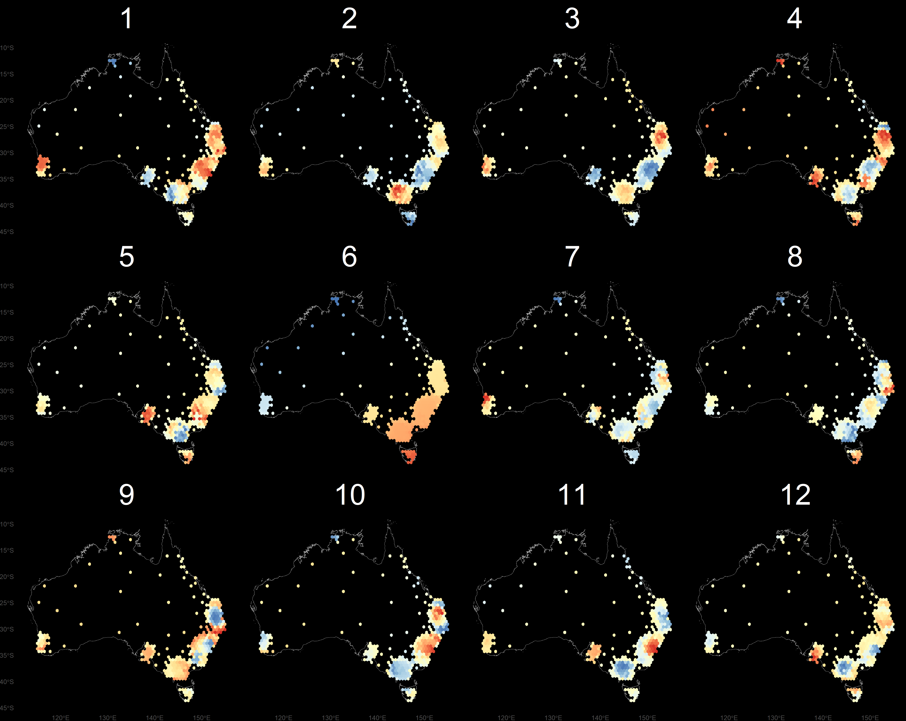
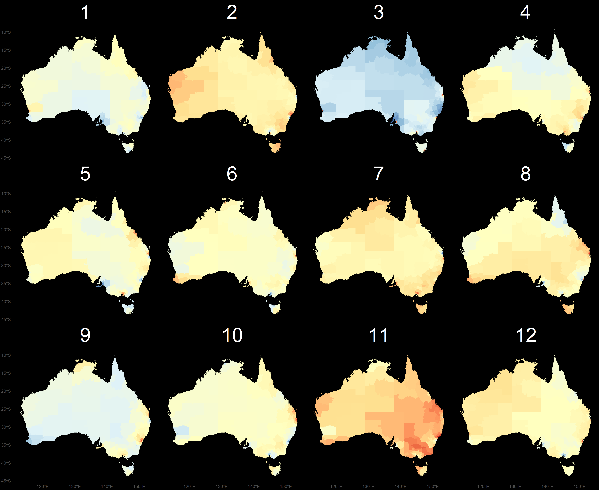

```{r setup, include=FALSE}
knitr::opts_chunk$set(
  echo = FALSE,
  warning = FALSE,
  error = FALSE, 
  message = FALSE,
  cache = FALSE,
  dpi = 300)
```

```{r libraries}
# Load Libraries
library(tidyverse)
library(cowplot)
library(png)
library(grid)
library(lubridate)
library(broom)
library(readxl)
library(lme4)
library(ggthemes)
library(RColorBrewer)
library(visreg)
library(emmeans)
library(knitr)
library(kableExtra)

options(knitr.kable.digits = "2")
```

```{r data}
trend_colours <- c(
  "NW-SE" = "#B2DF8A",
  "Three Cities" = "#A6CEE3",
  "All Cities" = "#1F78B4")
  
type_colours <- c(
  "Choro." = "#fcae91",
  "Hex." = "#a50f15")

detect_f_colours <- c(
  "No" = "#66C2A5",
  "Yes" = "#FC8D62")

detect_colours <- c(
  "Detected? No" = "#66C2A5",
  "Detected? Yes" = "#FC8D62")

  # Downloaded data
d <- read_xlsx("data/experiment-export.xlsx", sheet=2) %>%
  filter(!is.na(contributor)) %>%
  mutate(contributor = factor(contributor))

# Check data set 
# Need to clean multiple entries, 48, 24
# remove duplicated entries due to submit button
d <- d %>% group_by(group, contributor, image_name) %>%
  slice(1) %>% ungroup() %>% 
  arrange(group, contributor, plot_order)

# Remove contributors who did not provide answers to most questions
keep <- d %>% count(contributor, sort = TRUE) %>% filter(n > 10)
d <- d %>% 
  filter(contributor %in% keep$contributor) %>%
  filter(contributor != "1234567890")

# Remove contributors who did not provide any choices
bad_contribs <- d %>% group_by(contributor) %>% 
  summarise(sum0 = sum(choice)) %>% 
  filter(sum0 == 0) %>% 
  pull(contributor)

d <- d %>% 
  filter(!(contributor %in% bad_contribs))


n_contributors <- d %>% count(contributor, sort=TRUE) %>% 
  summarise(n_contributors = length(contributor))

d <- d %>% mutate(certainty = factor(as.character(certainty),
  levels = c("1", "2", "3", "4","5"), ordered=TRUE))
```


```{r reps}
replicate <- tibble(image_name = c("aus_cities_12_geo.png", "aus_cities_12_hex.png", 
                                   "aus_cities_3_geo.png", "aus_cities_3_hex.png",
                                   "aus_cities_4_geo.png", "aus_cities_4_hex.png",
                                   "aus_cities_9_geo.png", "aus_cities_9_hex.png",
                                   "aus_nwse_2_geo.png", "aus_nwse_2_hex.png",
                                   "aus_nwse_3_geo.png", "aus_nwse_3_hex.png",
                                   "aus_nwse_5_geo.png", "aus_nwse_5_hex.png",
                                   "aus_nwse_6_geo.png", "aus_nwse_6_hex.png",
                                   "aus_three_12_geo.png", "aus_three_12_hex.png",
                                   "aus_three_5_geo.png", "aus_three_5_hex.png",
                                   "aus_three_8_geo.png", "aus_three_8_hex.png",
                                   "aus_three_9_geo.png", "aus_three_9_hex.png"),
                    replicate = c(1, 1, 2, 2, 3, 3, 4, 4, 
                                  1, 1, 2, 2, 3, 3, 4, 4,
                                  1, 1, 2, 2, 3, 3, 4, 4))
# Add rep info to data
d <- d %>% left_join(., replicate, by = "image_name")
```

```{r pdetection_group}
# Tidy for analysis
d <- d %>% 
  separate(image_name, c("nothing", "trend", "location", "type", "extra"), remove = FALSE) %>%
  select(-nothing, -extra) %>%
  mutate(location = as.numeric(location), 
    # detect measures the accuracy of the choice
         detect = ifelse(location == choice, 1, 0)) %>% 
  mutate(trend = case_when(
    trend == "nwse" ~ "NW-SE",
    trend == "cities" ~ "All Cities",
    trend == "three" ~ "Three Cities")) %>% 
  mutate(trend = fct_relevel(trend, "NW-SE","Three Cities","All Cities")) %>% 
  mutate(type = case_when(
    type == "hex" ~"Hex.",
    TRUE~"Choro.")) %>% 
    mutate(detect_f = factor(detect, levels = c(0,1), labels = c("Detected? No", "Detected? Yes")))

plots <- d %>% group_by(group, trend, type, location) %>%
  # pdetect measures the aggregated accuracy of the choices
  summarise(pdetect = length(detect[detect == 1])/length(detect)) 
```


Introduction
=============
<!-- no \IEEEPARstart -->
<!-- (should never be an issue) -->

<!-- General: comparison of displays, motivate hexagon tile map, enough info to motivate aims -->
<!-- geographies on choropleth -->
This study contrasts the use of two displays for geospatial statistics, the traditional choropleth map and an alternative tessellated hexagon tile map. The choropleth map is the common choice for visualising aggregated statistics and is familiar because of common administrative boundaries. 
A hexagon tile map forgoes the familiar boundaries, instead representing each geographic unit as an equally sized hexagon. This alternative display is suggested for communicating distributions that relate to the population values or density of the population in each geographic unit. This study uses the lineup protocol for visual inference testing of the recognition of spatial distributions. The Australian Cancer Atlas explores spatial distributions of cancer incidence and the burden on Australian communities. The spatial distributions of the cancers explored in this atlas inspired the trend models presented to participants in this study. 

Motivation
=============

<!-- Find a new display for the Cancer Atlas -->

## The Australian Cancer Atlas

The Australian Cancer Atlas is an online interactive web tool created to explore the burden of cancer on Australian communities. There are many cancer types to be explored individually or aggregated. 
The Atlas examines Australian communities at the Statistical Areas at Level 2 (SA2) [@abs2016] used by the Australian Bureau of Statistics. Bayesian spatial smoothing was applied to integrate the values of neighbouring areas. Spatial smoothing protects the privacy and gives stability to the estimated amounts in each SA2. Users of the Atlas can explore the difference of the statistic of each SA2 from the Australian average, for both diagnoses (Standardised Incidence Rates) and excess deaths. It communicates the value of the statistic for each SA2 geographic unit through colour, by filling the areas using the diverging colour scheme ranging from dark blue to red. 
The Australian Cancer Atlas allows users to explore the patterns in the distributions of cancer statistics over the geographic space of Australia. It uses a choropleth map display and diverging colour scheme to draw attention to relationships between neighbouring areas. 


Background
=============

## Population focussed displays

  
Spatial visualisations communicate the distribution of statistics over geographic space. The most common display for spatial data is the choropleth map. It is used to present aggregated statistics for geographic units such as the population. Creating a choropleth map involves drawing the administrative boundaries and filling them with colour to communicate the value of the statistic. However, using a choropleth map base introduces biases when considering population related distributions [@CBATCC].
Many sets of Australian statistical areas have a large disparity between the smallest and largest units.
The rural communities in Australia operate on a much larger geographic space than small inner-city communities. When a spatial distribution is related to the size of the areas, or the population density, the size of the regions can allow erroneous conclusions to be drawn about the state of the statistic over the entire population, when presenting the statistics on a geographic map base. This occurs as large regions filled with a consistent colour or pattern can draw the attention of map readers, and small regions are not paid equal attention [@CTTMB]. An alternative display can be used to honestly communicate a spatial distribution for a set of heterogeneous areas [@NISCC]. 
This work aims to show that a hexagon tile map display is a viable alternative to the geographic map base for presenting population statistics.


A choropleth map is not the only display that can be used for presenting geospatial data. 
Alternative maps include various cartograms and tessellated tile maps. They allow other variables to be incorporated in the display to highlight the statistical values of various geographic areas.


<!-- Cartogram -->
A cartogram transforms the geographic map base. The transformation begins with a choropleth map, and the values of a statistic such as population, for each geographic unit. There are several algorithms for transformation [@ACTUC], [@CBATCC]; they involve shifting the boundaries of geographic units, using the value of the statistic to increase or decrease the area taken by the geographic unit on the map.
<!-- Why not a cartogram-->
The changes to the boundaries result in cartograms that accurately communicate population by map area for each of the geographic units. The transformation will keep boundaries of neighbouring areas connected, but the result is unfamiliar shapes for each geographic unit. 

<!-- Tesselated tile gram & hexagon tile map-->
Alternative displays make the trade off between familiar shapes and representation of variables using the area of geographic units. The non-contiguous cartgoram method [@NAC] keeps the shapes of geographic units intact, and change the size of the shape to communicate the values of statistics. This method disconnects areas when shrinking boundaries, and breaks the spatial relationship between areas. However, the empty space created emphasises the comparative density of the statistic, the difference between the statistic and the amount of land for each geographic unit.
The Dorling cartogram [@ACTUC] is another method that does not retain the boundaries of geographic units. Each unit becomes one circle on the cartogram display; the circles are sized according to the value of a the statistic, such as population. The neighbour relationships can be illustrated by connecting the boundaries of the circles. A similar approach was pioneered by Raisz [-@RSCW], using rectangles that tile to align borders of neighbours [@CDWCS].
These cartogram methods all allow two variables to be shown in the single display. these methods are discussed further in XXX cite review paper

```{r liver, fig.height = 9, fig.width = 6, fig.cap = "The smoothed average of liver cancer diagnoses for Australian males. The divering colour scheme shows dark blue areas with much lower than average diagnoses, yellow areas with diagnoses around the Australian average, orange with above average and red shows diagnoses much higher than average."}
ggdraw(ylim = c(0,2), xlim = c(0,1.3), clip = "on") +
  draw_plot(rasterGrob(readPNG("figures/aus_liver_m.png")), -0.15, 0.9, 1.6, 1.2) +
  draw_plot(rasterGrob(readPNG("figures/aus_liver_m_hex.png")), -0.15, -0.1, 1.6, 1.2) +
  draw_plot_label(c("a", "b"), 
    c(0.05, 0.05), c(1.95, 1), size = 20, color = "white") + 
  theme(plot.background = element_rect(fill = "black"))
```

<!-- Specific problem for Australia -->
Australia is an extreme case of heterogenous geographic units, with large difference between the smallest and largest geographic units across various granularities.
To communicate information regarding the small inner-city geographic units of Australian cities an alternative display must be employed. This will emphasise the value of the statistic for areas with high population. Figure \ref{fig:liver} shows the distribution of the smoothed average amount of Liver cancer diagnoses for Australian Males from 2005-2014.
These inner-city areas are not visible on the choropleth map (a). The hexagon tile map (b) shows orange hexagons for the inner-city SA2s with higher than average levels of diagnoses in the capital cities of Melbourne and Sydney. The northern Queensland, and Northern Territory SA2's with higher than average rates are still visible but use less map space on the hexagon tile map. There are still many light blue areas in both displays. 


## Visual Inference

The hexagon tile map is suggested as an alternative display. To test the effectiveness of these displays there is a formal testing framework. Visual inference considers the communication of data or data summaries through visualisations. It considers these visualisations to be visual statistics, with observable features.


Classical statistical inference involves hypothesis testing, the process of rejecting a null hypothesis in favour of an alternative. This approach requires appropriate data, with the appropriate distributions and their assumptions. 
The lineup protocol was formalised as a test for the effectiveness of a visualisation. Rather than use classical statistical tests, human participants are tasked with finding the display that shows structure between the variables. If the structure is not detected, then it is not significantly different from the null data.


Visual inference uses the general hypothesis structure: 

- Null hypothesis: There is NO relationship between the variables,

- Alternative hypothesis: There is a relationship between the variables.

To test these hypotheses, the line up protocol randomly places a "guilty" data visualisation in a lineup of "innocents". Where the guilty data set contains structure, and the innocents data sets do not.
In a grid of visualisations, an observer is asked to pick the display that is most different, if they select the data set containing structure, they have identified the guilty hidden within the  innocents [@GTPCCD].
The guilty data is identified as different from the innocent data with probability $1/m$, where $m$ is the number of null plots plus 1 to account account for the guilty data set. When the guilty data set is chosen, the null hypothesis that it was innocent is rejected with a $1/m$ chance or type I error of being wrong.

The lineup protocol can be used in a variety of testing scenarios for visualisations. @GIIV suggest the choropleth map for testing spatial structure in a data set. The lineup protocol allows for flexibility in the definition of null data. In the case of spatial visualisations it is likely that neighbours are related to some degree. To account for this, null data sets can be generated by sampling from a known model that accounts for spatial covariance. 

To contrast the effectiveness of two displays, the data set of null data plots with a hidden real data plot can be produced using the different plot designs.
The time taken by participants to evaluate the same data in the different displays can be compared. Their accuracy in detecting the real data plot can also be calculated and contrasted.


Methodology
============

This study aimed to answer two key questions around the presentation of spatial distributions:

1. Are spatial disease trends, that impact highly populated small areas, detected with higher accuracy when viewed in a hexagon tile map display?

2. Are people faster in detecting spatial disease trends, that impact highly populated small areas, when using a hexagon tile map display?

Additional considerations when completing this experimental task included exploration of the difficulty experienced by participants, and the certainty they felt about their decision.


The mean of the detection rate for choropleth map, denoted as $\mu_C$, and the hexagon tile maps, $\mu_H$ will be contrasted. This leads to the following one sided hypothesis:

$H_0$ : $\mu_H$ = $\mu_C$
$H_a$ : $\mu_H$ > $\mu_C$

The detection rate $\hat\pi$ is calculated as the amount of people that made the choice of plot that contained the real data, out of the participants who saw data plot in the lineup of the null data plots.

The difference in the detection rates for the two displays will be compared using a two sample unpaired t-test.


## Participants

Participants were recruited for a survey style task to test the effectiveness of the hexagon tile map display.
It was expected that the participants were uninvolved judges that had no prior knowledge of the data, to avoid discrimination or advantages.
The Figure-Eight crowd source platform was used to advertise the survey to potential participants that had acheived level 2 or level 3 on the Figure-Eight Platform.
The participants were chosen as they have experience with survey tasks that involve evaluating images. They participants on the platform are also required to be at least 18 years old.

Participants were able to choose to participate by selecting this task from the list of tasks available to them.
There were 95 participants involved in the study. All of these participants read the introductory materials and viewed example questions before proceeding to the survey. Each participant was trained using three test displays orienting them to the evaluation task, these displays are shown in supplementary materials section regarding [training].
All participants who volunteered to take part were compensated for their time via the payment system of Figure-Eight.

Participants were allocated to either group A or group B when they proceeded to the survey web application, hosted externally from the Figure-Eight website. 


## Variables

The variables that were changed between groups were the type of plot shown and the trend model.

The twenty-four lineup displays were created by a combination of map type, and spatial trend model. This set of displays was split into a collection of twelve displays for Group A and twelve displays for Group B. 

Each participant was randomly allocated to either Group A or Group B when they begun the survey. This resulted in 42 participants allocated to Group A, and 53 participants allocated to Group B.

    
The levels of the factors measured in the experiment were:

  - Map type: *Choropleth, Hexagon tile*
  - Trend: *Locations in three population centres, Locations in multiple population centres, South-East to North-West*

Each Group did not see the same data for both map types. Four simulated sets of data were generated for each treatment.
This will generate twenty-four lineups (twelve lineups of geographic maps, and twelve lineups of hexagon tile maps). Participants evaluated twelve lineups, siz of each map type.
For each of the six geographic displays and six hexagon displays, two of each trend model were shown to participants. The design is outlined in \ref{tab:exp-design}.

```{r exp-design, results = "asis"}
d %>% 
  mutate(Trend = trend,
    Group = group,
    `Map Type` = type) %>% 
  group_by(Group, Trend, `Map Type`) %>% 
  summarise(Reps = paste0(sort(unique(replicate)), collapse = ", ")) %>% 
  pivot_wider(names_from = c("Map Type"), values_from = c("Reps")) %>% 
  ungroup() %>% 
  knitr::kable(., format = "latex", booktabs = TRUE, 
    linesep = c("", "", "\\addlinespace"),
    caption = "The experimental design results in the following allocation of replicate data sets within each trend model to groups A and B.") %>% kable_styling(bootstrap_options = "hold_position") %>% 
  collapse_rows(., columns = 1, custom_latex_hline = c(1:3))
```

The variables measured as a result of the changes were the probability of detection each display and the time taken to submit responses.
To measure the accuracy of the detections, the plot chosen for each lineup evaluated was compared to the position of the real spatial trend plot in the lineup. A correct result occurs when the chosen plot matches the position of the real plot, this was recorded in an additional binary variable; 1 = correct; 0 = incorrect.
High efficiency occurs when a small amount of time is taken to evaluate each lineup. This will be measured as the numeric variable measuring the length of time taken to submit the answers to the evaluation of each line up.

## Simulation process

The lineup protocol allows a known model to be imposed on the null data set plots.
The underlying spatial correlation model was created to provide spatial autocorrelation between neighbouring areas using the longitude and latitude values for the Statistical Areas.

$$z = 1$$
$$locations = longitude + latitude$$

The null model imposed suggests that neighbours are related. The randomness imposed was smoothed to mirror the practice taken by the Australian Cancer Atlas. This smoothing allowed neighbours to be related to each other and show distributions similar to the Liver cancer distribution shown in \ref{fig:liver}. 

Spatially dependent data sets were simulated using the variogram model on the centroids of each geographic unit. Twelve simulations from the variogram model were created for each of the twelve lineups.

In these 12 sets of data, each of the 144 maps were smoothed several times to replicate the spatial autocorrelation seen in cancer data sets presented in the Australian Cancer Atlas.

For each of the 144 individual maps, the values attributed to each geographic area are rescaled to show a similar colour scale from deep blue to dark red within each map.

A random location was selected for each set of lineup data.
In this location, a trend model was overlaid on the null set of spatially correlated data.
Each set of lineup data was used to produce a choropleth maps and hexagon tile maps. These matched pairs were split between Group A and Group B.

## Experiment procudure and data collection

The participant answered demographic questions and provided consent before evaluating the lineups.

Demographics were collected regarding the study participants:

 - Gender (female / male / other),
 - Degree education level achieved (high school / bachelors / masters / doctorate / other),
 - Age range (18-24 / 25-34 / 35-44 / 45-54 / 55+ / other)
 - Lived at least for one year in Australia (Yes / No )

Participants then moved to the evaulation phase.
The set of images differed for Group A and Group B.
After being allocated to a group, each individual was shown the 12 displays in randomised order.

Three questions were asked regarding each display:

 - Plot choice
 - Reason
 - Difficulty

After completing the 12 evaluations, the participants were asked to submit their responses.

Data was collected through a web application containing the online survey.
Each participant used the internet to access the survey.
The data collection took place using a secure link between the survey web application and the googlesheet used to store results. The application would first connect to the googlesheet using the googlesheets [@sheets] R package, and interacted again at the completion of the survey by adding the participant's responses to the 12 displays as 12 rows of data in the googlesheet.


## Experimental design


The choropleth map was used as the comparative visualisation for presenting the lineups [@VVSIALM] as this is the common display for spatial cancer data.
Geographic distributions usually have some degree of spatial autcorrelation between neighbours.
This feature was incorporated in all maps shown in the lineup displays, the map that contained the trend feature shown in only one set of data was also affected by spatial autocorrelation.
A line up protocol was implemented to arrange $N$ maps in each display. 
A reasonable amount of null plots $N-1$ in the lineup was chosen to ensure the real data map was well hidden. A reasonable number of plots to show in each lineup, $N = 12$ was chosen to not overwhelm participants due to the detailed choropleth maps of Australian SA3 areas.

The hypotheses for each lineup are
$H_0$ : All plots look the same
$H_a$ : One plot looks different to the other plots 


The same data was visualised on a choropleth map, and on a hexagon tile map, however in this study the participants only saw one of these two displays. The accuracy and times taken were aggregated for Groups and.
Comparing the results of participants who see the choropleth to those who see a hexagon tile map will show that population related distributions are spotted more frequently in a hexagon tile map display.


Let $n$ be the number of independent observers and $x_i$ the
number of observers who picked plot $i$, $i = \{1,...,m\}$

Then $x_i, x_2, ..., x_m$ follows a multinomial
distribution$Mult_{\pi_1, \pi_2, ...., \pi_m}(x_i, x_2, ..., x_m)$ with 
$\sum_i \pi_i = 1$, where $\pi_i$ is the probability that plot $i$ is picked by an
observer, which we can estimate as $\hat{\pi}_i = x_i/n$.
The researchers compared the length of time taken, and the accuracy of the participants choices.
The power of a lineup can therefore be estimated as the ratio of correct
identifications $x$ out of $n$ viewings.

## The methods of data analysis used
The data analysis methods used in order to analyse and collate the results included downloading the survey submissions and opening them into the analysis software R [@RCore].
   
For each of the 12 lineup displays the researchers calculated:

 - accuracy: the proportion of subjects who detected the data plot
 - efficiency: average time taken to respond

### Visualisations
Side-by-side dot plots were made of accuracy (efficiency) against map type, facetted by trend model type.

Similar plots were made of the feedback and demographic variables - reason for choice, reported difficulty, gender, age, education, having lived in Australia - against the design variables.

Plots will be made in R (R Core Team 2019), with the ggplot2 package (Wickham 2016).   
   
   
### Modeling

The likelihood of detecting the data plot in the lineup can be modelled using a linear mixed effects model. 
The R [@RCore] `glmer()` function in the [@lme4] package implements generalised linear mixed effect models. The model used includes the two main effects map type and trend model, which gives the fixed effects model to be:


$$\widehat{y_{ij}} = \mu + \tau_i + \delta_j + (\tau\delta)_{ij} + \epsilon_{i,j}, ~~~ i=1,2; ~j=1,2,3$$

where $y_{ij} = 0, 1$ whether the subject detected the data plot, $\mu$ is the overall mean, $\tau_i, i=1,2$ is the map type effect, $\delta_j$ is the trend model effect. We are allowing for an interaction between map type and trend model. Because the response is binary, a logistic model is used. This model can account for each individual participants’ abilities as it includes a subject-specific random intercept. As each participant provides results from 12 lineups.

The model specifies a logistic link, this means the predicted values from the `glmer` model should be back-transformed to fit between 0 and 1. They are transformed with the link specified below:


$$\mu = \frac{e^{\eta}}{1 + e^{\eta}}$$
$$\eta = f(\tau_i,\delta_j)$$


A similar model will be constructed for the efficiency, using a log time, and normal errors. 

The feedback and demographic variables will possibly be incorporated as covariates.

Computation will be done using R [@RCore], with the `lme4` package [@lme4].


## Limitations of the data collection

A pilot study was conducted to determine whether the lineups were appropriate. All lineups in the pilot study were deemed viable as at least one participant detected the real data plot in each lineup.
The demographics of the participants showed a skew towards male participants. 
The randomness of the group allocation also resulted in more participants being allocated to Group B. Due to the allocation of lineup displays the participants all saw six Choropleth displays and six Hexagon Tile Map displays.


Results
============

<!--
The results section explores the [Accuracy] and contrasts the detection rate of the real data plot in the lineups.
The second section considers the [Speed] participants had when submitting their responses to the three questions asked regarding each display.
The [Certainty] participants felt about their decisions and the [Reason] for their choice in plot is also discussed.
-->

Responses from 95 participants were collected. Three participants provided no answers for any task, and their data was removed. Set A was evaluated by 42 participants, and 53 evaluated set B. This resulted in 1104 evaluations, corresponding to 92 subjects, each evaluating 12 lineups, that are analysed on accuracy and speed. The certainty and reasons of subjects in their answers is also examined. 

## Participant demographics

Of the 92 participants, 67 were male, and 25 female. Most participants (56) had a Bacherlors degree, 13 had a Masters degree, and the remaining 23 had high school diplomas.

## Accuracy

Figure \ref{fig:detect-compare} displays the average detection rates for the two types of plot, separately for each trend model. Evaluations on the same data set are connected by a line segment. For both the Three Cities and All Cities trend models performance was substantially better for the hexagon tile map. Viewers detected the data plot substantially more often with the hexagon tile map. One replicate for the All Cities group, had similar detection rates for both plot types, and this is discussed in the supplementary [Lineups] section. Surprisingly, participants could also detect the gradual spatial trend in the NW-SE group from the hexagon tile map. We expected that the choropleth map would be superior for the type of spatial pattern, but the data suggests the hexagon tile map performs slightly better, or equally as well.

Table \ref{tab:desc-stats} shows the means and standard deviations of the detection rate for each type of plot and each trend model. This also gives the standard errors, the smallest standard deviation is the Three Cities trend model shown in a Choropleth display. This group had a very small detection rate of 0.038.

```{r detect-compare, fig.cap = "The detection rates achieved by participants are contrasted when viewing the four replicates of the three trend models. Each point shows the probability of detection for the lineup display, the facets separate the trend models hidden in the lineup. The points for the same data set shown in a choroleth or haxgon tile map display are linked to show the difference in the detection rate.", fig.height=4}
# Detectability rate for each lineup (image)
d_smry <- d %>% group_by(trend, type, replicate) %>%
  # pdetect measures the aggregated accuracy of the choices
  summarise(pdetect = length(detect[detect == 1])/length(detect)) %>%
  ungroup()

# Numerical summary
diffs <- d_smry %>% spread(type, pdetect) %>%
  mutate(dif = `Hex.` - `Choro.`)

# Plot summary
ggplot(d_smry, aes(x=type, y=pdetect, colour = trend)) +
  geom_point(size = 2) +  
  geom_line(size = 1, aes(group = replicate)) +  
  facet_wrap(~trend) +
  scale_colour_manual(values = trend_colours) +
  xlab("Type of areas visualised") +
  ylab("Detection rate") + 
  ylim(0,1) +
  guides(colour = FALSE)
```


```{r desc-stats, results = "asis"}
types <- c("Choro.", "", "Hex.", "")

d %>% group_by(type, trend) %>%
  summarise(m = round(mean(detect),2),
    std.dev = round(sd(detect),2)) %>% 
  mutate(std.dev = ifelse(std.dev == 0.5, "(0.50)", paste0("(", std.dev, ")"))) %>% 
  gather(stat, value, m, std.dev) %>% 
  pivot_wider(names_from = "trend", values_from = "value") %>% 
  arrange(type) %>% ungroup() %>% 
  mutate(Type = types) %>% select(Type, `NW-SE`, `Three Cities`, `All Cities`) %>%
  knitr::kable(., format = "latex", align = "lccc", booktabs = TRUE, 
    linesep = c("", "\\addlinespace"),
    caption = "The rate of detection for each trend model has been calculate for the choropleth and hexagon tile map displays. The associated standard errors are also included.")
```


```{r detect-glmer1, results="asis"}
# Mixed effects models
glmer1 <- glmer(detect ~ type*trend + (1|contributor), 
              family = binomial, data = d)

glmer_terms <- c("Intercept", "Hex.", "Three Cities", "All Cities", "Hex:Three Cities", "Hex:All Cities")

detection_rates <- tidy(glmer1) %>%
  mutate(detection_rates = round(exp(estimate)/(1+exp(estimate)),2)) %>%
  select(term, estimate, detection_rates) %>% pull(detection_rates)

tidy(glmer1) %>%
  mutate_at(.vars = c("estimate", "std.error"), round, 2) %>% 
  mutate(p.value = round(p.value, digits=2)) %>% 
  rowwise() %>%
  mutate(sig = case_when(
  p.value <= 0.001 ~ "$^{***}$",
  p.value <= 0.01 ~  "$^{**}$",
  p.value <= 0.05 ~  "$^{*}$",
  p.value <= 0.01 ~  "$^{.}$",
  TRUE ~ "$^{ }$")) %>%
  ungroup() %>% 
  filter(!is.na(std.error)) %>%
  mutate(term = glmer_terms) %>% 
  select(Term = term, 
    Est. = estimate, 
    Sig. = sig,
    `Std. Error` = std.error, 
    `P val` = p.value) %>% 
  knitr::kable(format = "latex", escape = FALSE, align= "rrlrr", 
    booktabs = T, linesep = c("", "\\addlinespace", "", "\\addlinespace", ""), 
    caption = "The model output for the generalised linear mixed effect model for detection rate. This model considers the type of display, the trend model hidden in the data plot, and accounts for contributor performance.")
```


Table \ref{tab:detect-glmer1} is a summary of the generalised linear mixed effects model, testing the effect of plot type and trend model on detection rate. The results support the summary from Figure \ref{fig:detect-compare}. All terms are statistically significant. Overall, the hexagon tile map performs marginally better than the choropleth for all trend models, which is a pleasant surprise. 
For the NW-SE distribution, the predicted detection rate for the hexagon tile map display increases the predicted probability of detection to `r round(exp(0.461+0.0220)/(1+exp(0.461+0.0220)), 2)` from `r round(exp(0.0220)/(1+exp(0.0220)),2)` for choropleths. 

When a choropleth map display is used, the predicted detection rate for the Three Cities trend, `r round(exp(0.0220-3.43)/(1+exp(0.0220-3.43)),2)`, is extremely low, especially compared to  the NW-SE trend. When the All Cities trend is presented in a choropleth display the predicted probability of detection is `r round(exp(0.0220-1.35)/(1+exp(0.0220-1.35)),2)`. The hexagon tile map has a substantially high detection rate for the display of a Three Cities trend `r round(exp(0.461+0.0220-3.43+2.46)/(1+exp(0.461+0.0220-3.43+2.46)),2)` and All Cities trend `r round(exp(0.461+0.0220-1.35+1.17)/(1+exp(0.461+0.0220-1.35+1.17)),2)`.


## Speed

Figure \ref{fig:beeswarm} shows the time taken for participants to evaluate each lineup, separately for trend model, whether the data plot was detected or not, and type of plot, as horizontally jittered dot plots. The time taken to complete an evaluation ranged from milliseconds to 60 seconds. The average time taken for type of display is displayed as a large colored dot on each plot. There is little difference in the average time taken to read a choropleth or hexgon tile map. There is also very little difference in evaluation time whether the data plot was detected or not. 


```{r beeswarm, fig.cap = "The distribution of the time taken (seconds) to submit a response for each combination of trend, whether the data plot was detected, and type of display, shown using horizontally jittered dotplots. The coloured point indicates average time taken for each plot type. Although some participants take just a few seconds per evaluation, and some take as much as mcuh as 60 seconds, but there is very little difference in time taken between plot types.", fig.height=8}
# Di playing
s <- d %>% group_by(type, trend, detect_f) %>%
  summarise(m=median(time_taken), 
            q1=quantile(time_taken, 0.25), 
            q3=quantile(time_taken, 0.75))
library(ggbeeswarm)
ggplot() + 
  geom_quasirandom(data=d, aes(x=type, y=time_taken), alpha=0.9) + 
  #geom_hline(data=s, aes(yintercept=m, colour=type)) +
  geom_point(data=s, aes(x=type, y=m, colour=type), size=5, alpha=0.7) +
  #geom_errorbar(data=s, aes(x=type, ymin=q1, ymax=q3, colour=type), width=0.3, size=2) +
  scale_colour_brewer("", palette = "Dark2") +
  facet_grid(trend~detect_f) + 
  ylab("Time taken (seconds)") + xlab("") +
  theme(legend.position="bottom")
```


## Certainty

```{r certainty, fig.cap = "The amount of times each level of certainty was chosen by participants when viewing hexagon tile map or choropleth displays. Participants were more likely to choose a high certainty when considering a Choropleth map. The mid value of 3 was the default certainty, it was chosen most for the Hexagon tile map displays.", fig.height=5}
d <- d %>% 
  mutate(certainty = as_factor(certainty)) %>% 
  mutate(replicate_f = as_factor(replicate)) 

ggplot(d %>% rename(Detected = detect_f), 
   aes(x = certainty, fill = Detected)) +  
  scale_fill_manual(values = detect_colours) +
  geom_bar() + facet_grid(type ~ trend) +
  theme(legend.position = "bottom") + xlab("Level of certainty")
```

Certainty levels are measured on a five point scale—they are subjective
assessments by the participant ‘How certain are you about your choice?’.


## Reason

```{r reason, results = "asis"}
# Qualitative analysis of reason
d %>% 
  mutate(reason = ifelse(reason =="0.0", "no reason", reason)) %>% 
  mutate(Detected = ifelse(detect_f == "Detected? Yes", "Yes", "No"),
    Trend = trend) %>% 
  group_by(Trend, Detected, type) %>% 
  count(reason) %>% 
  mutate(prop = round(n/sum(n), 2), r_prop = paste0(reason, ":", prop)) %>% 
  top_n(1, n) %>% summarise(reasons = paste(reason, collapse=", ")) %>% 
  pivot_wider(names_from = c("type"), values_from = c("reasons")) %>% 
  ungroup() %>% 
  knitr::kable(., format = "latex", booktabs = TRUE,
    linesep = c("", "\\addlinespace", "", "\\addlinespace",""),
    caption = "The amount of participants that selected each reason for their choice of plot when looking at each trend model shown in Choropleth and Hexagon Tile maps. The facets show whether or not the choice was correct.") %>% 
  #kable_styling(bootstrap_options = "hold_position") %>% 
  collapse_rows(., columns = 1)
```

The most common choice made by participant was clusters, this response was expected when participants viewed the Hexagon display of the All Cities and Three Cities distributions.


## Anomolies


The choices made by participants are examined in Figure \ref{fig:choices}.
Participants were misled by the choropleth display, but not the hexagon display for All Cities displays except (2). The maps with a North West to South East trend was chosen with much greater frequency in all displays. All of Three Cities displays, except (4), were detected in the hexagon display. All except one lineup had at least one participant select the correct map in the lineup as shown in Figure \ref{fig:choices}.


```{r choices, fig.cap = "Each facet is associated with one lineup, the height of the points show the proportion of the participants that made each choice when considering each lineup. The points coloured orange show the map which contained a trend model, these are the correct choices. The numbers differentiate the replicates of each trend model and type of map display. Participants were able to select 0 to indicate they did not want to choose a map."}
d %>% 
  count(type, trend, choice, replicate, choice, detect_f) %>% 
  group_by(type, trend, replicate) %>% 
  mutate(prop = n/sum(n)) %>% 
  mutate(repl = paste("Rep:", replicate, ":\n", type,  sep = "")) %>%
  mutate(bottom = 0) %>% 
  ggplot() + 
  geom_point(aes(x = choice, y = prop, color = detect_f), size = 4) + 
  geom_segment(aes(x = choice, xend = choice,y = bottom, yend = prop, colour = detect_f), size = 1) +
  facet_grid(repl ~ trend, 
    drop = TRUE, as.table = TRUE, scales = "free_y") +
  labs(x = "Choice of plot in lineup", y = "Amount of choices") +
  scale_colour_manual(values = detect_colours) +
  scale_x_continuous(breaks = seq(from = 0, to = 12)) +
  scale_y_continuous(breaks = seq(from = 0.0, to = 1.0, by = 0.1)) +
  theme(legend.position = "bottom") + 
  guides(colour = FALSE, fill = FALSE) +
  theme(strip.text.y = element_text(angle = 0))
```


One lineup had extremely similiar detection rates for the Choropleth and Hexagon displays.





### Certainty


Discussion
============


Conclusion
============

The choropleth map display and the tessellated hexagon tile map have been contrasted in a visual inference study. 
The hexagon tile map was significantly more effective for spotting a real data trend model hidden in a lineup.

This hexagon tile map display should be considered as a visualisation method when communicating distributions that relate to the population in each geographic unit. Cancer Atlas products may benefit from the opportunity to allow exploration via the traditional choropleth map method as well as an alternative display. The spatial distributions used to test these displays were inspired by the real spatially smoothed estimates of the cancer burden on Australian communities. However, this technique may be extended to other population related distributions, such as other diseases.

The increasing population densities of capital cities despite large land area exaserbates the difference in the smallest and largest communities.
The population density structure of Australia can be considered similar to that of Canada, New Zealand and many others. Therefore, this display is not only relevant to Australia, but all nations or population collections that experience densely populated cities alongside vast rural expanses.


<!-- conference papers do not normally have an appendix -->

\newpage
Supplementary Materials
============

## Training {#training}

The participants were trained using three displays. There were relatively simple lineups and are shown in Figure XXX.
<!--

\begin{figure}[!t] 
\centering 
\includegraphics[width=2.5in]{figures/fig8_training1.png}
\caption{The training lineups of choropleth maps.}
\label{training1} 
\end{figure} 


\begin{figure}[!t] 
\centering 
\includegraphics[width=2.5in]{figures/fig8_training1.png}
\caption{The training lineups of hexagon tile maps.}
\label{straining2} 
\end{figure} 
-->

## Survey application

The survey application was hosted on a website external to the Figure-Eight platform. Following suggestions in the documentation, the information and training required for a participant to make a decision was included  that survey

The demonstrative images of the `shinydashboard` web application display the demographic and consent page in Figure
\ref{fig:survey_demogs}.


<!--

\begin{figure}[!t] 
\centering 
\includegraphics[width=6in]{figures/survey_demogs.png}
\caption{The demographics questions tab of the shinydashboard survey application.}
\label{survey_demogs} 
\end{figure} 

\begin{figure}[!t] 
\centering 
\includegraphics[width=6in]{figures/survey_hex.png}
\caption{An example of the hexagon tile map lineup shown in the survey tab of the shinydashboard app.}
\label{survey_hex} 
\end{figure} 


\begin{figure}[!t] 
\centering 
\includegraphics[width=6in]{figures/survey_choro.png}
\caption{An example of the choropleth map lineup shown in the survey tab of the shinydashboard app.}
\label{survey_choro} 
\end{figure} 
-->

## Lineups


Replicate 3 of the All Cities distribution is shown in Figures . The same data set is shown in both displays, the difference is the land area of each SA3 is coloured in the choropleth and the hexagon representing the SA3 is coloured in the Hexagon Tile Map. Many maps in the Choropleth lineup (a) are coloured yellow, two are half light blue, and two are obviously blue. Only one of the maps looks red. 

Lineups were created using the Australian Statistical Areas at Level 3.

 


The values for the inner city areas in the capital cities result in them being coloured red. However, the colour blue dominates the display as the large rural areas are filled. There were no other choropleth maps that were coloured as blue as map (3). This meant the detection rate was quite high, participants were able to select the correct distribution without being able to see the values of the capital cities.
The same data showed in the hexagon tile map display shows varied distributions across the lineup. They are more diverse in colour than the choropleth counterparts. The same location holds the real data plot, the red city centres are now visible and surrounded by yellow, and then blue hexagons.

## Overall Performance

```{r pdetection_trend, eval = FALSE}
plots %>% ggplot(aes(x = group, y = pdetect)) + 
  geom_boxplot() + 
  geom_jitter(width = 0.1) +
  ylab("Detection rate") + 
  ylim(c(0,1))

plots %>% ggplot(aes(x = trend, y = pdetect, fill = trend)) + 
  geom_boxplot() + 
  scale_fill_manual(values = trend_colours) +
  geom_jitter(width = 0.1) +
  ylab("Detection rate") + 
  ylim(c(0,1)) 

plots %>% ggplot(aes(x = type, y = pdetect)) + 
  geom_boxplot() + 
  geom_jitter(width = 0.1) +
  ylab("Detection rate") + 
  ylim(c(0,1))
```


## Contributor Performance

```{r contributors, fig.cap = "The probablity of detection acheived by the contributors in each group is shown by the points. Group B has a larger range and a smaller inter-quartile range. Group A and  both had 3 people who did not find any of the data maps in the displays."}
# Check contributor performance
contribs <- d %>% group_by(group, contributor) %>% 
  # pdetect measures the aggregated accuracy of the choices
  summarise(pdetect = mean(detect, na.rm = TRUE)) 

# Plot performance
contribs %>% ggplot(aes(x = group, y = pdetect)) + 
  geom_boxplot() + 
  geom_jitter(width = 0.1, height = 0, alpha = 0.7) + 
  ylab("Detection rate") + 
  ylim(0,1)
```


## Demographics:

```{r demogs, results = "asis"}
# Create one record for each contributor, to examine demographics
dem_contribs <- d %>%
  group_by(contributor) %>%
  slice(1) %>% ungroup()


# Demographics of contributors
#dem_contribs %>% count(gender)
dem_contribs %>% ggplot() + geom_bar(aes(age))


dem_contribs %>% count(gender) %>% knitr::kable(format = "latex", booktabs = TRUE)


dem_contribs %>% count(education) %>% knitr::kable(format = "latex", booktabs = TRUE)
```


Acknowledgment
==============

The authors would like to thank...


Ethics approval for the online survey was granted by QUT’s Ethics Committee (Ethics Application Number: 1900000991). All applicants provided informed consent in line with QUT regulations prior to participating in this research. 


\newpage
References {#references .numbered}
==========


<!-- An example of a floating figure using the graphicx package. -->
<!-- Note that \label must occur AFTER (or within) \caption. -->
<!-- For figures, \caption should occur after the \includegraphics. -->
<!-- Note that IEEEtran v1.7 and later has special internal code that -->
<!-- is designed to preserve the operation of \label within \caption -->
<!-- even when the captionsoff option is in effect. However, because -->
<!-- of issues like this, it may be the safest practice to put all your -->
<!-- \label just after \caption rather than within \caption{}. -->

<!-- Reminder: the "draftcls" or "draftclsnofoot", not "draft", class -->
<!-- option should be used if it is desired that the figures are to be -->
<!-- displayed while in draft mode. -->

<!-- \begin{figure}[!t] -->
<!-- \centering -->
<!-- \includegraphics[width=2.5in]{myfigure} -->
<!-- where an .eps filename suffix were assumed under latex,  -->
<!-- and a .pdf suffix were assumed for pdflatex; or what has been declared -->
<!-- via \DeclareGraphicsExtensions. -->
<!-- \caption{Simulation results for the network.} -->
<!-- \label{fig_sim} -->
<!-- \end{figure} -->

<!-- Note that the IEEE typically puts floats only at the top, even when this -->
<!-- results in a large percentage of a column being occupied by floats. -->


<!-- An example of a double column floating figure using two subfigures. -->
<!-- (The subfig.sty package must be loaded for this to work.) -->
<!-- The subfigure \label commands are set within each subfloat command, -->
<!-- and the \label for the overall figure must come after \caption. -->
<!-- \hfil is used as a separator to get equal spacing. -->
<!-- Watch out that the combined width of all the subfigures on a  -->
<!-- line do not exceed the text width or a line break will occur. -->

<!-- \begin{figure*}[!t] -->
<!-- \centering -->
<!-- \subfloat[Case I]{\includegraphics[width=2.5in]{box}% -->
<!-- \label{fig_first_case}} -->
<!-- \hfil -->
<!-- \subfloat[Case II]{\includegraphics[width=2.5in]{box}% -->
<!-- \label{fig_second_case}} -->
<!-- \caption{Simulation results for the network.} -->
<!-- \label{fig_sim} -->
<!-- \end{figure*} -->

<!-- Note that often IEEE papers with subfigures do not employ subfigure -->
<!-- captions (using the optional argument to \subfloat[]), but instead will -->
<!-- reference/describe all of them (a), (b), etc., within the main caption. -->
<!-- Be aware that for subfig.sty to generate the (a), (b), etc., subfigure -->
<!-- labels, the optional argument to \subfloat must be present. If a -->
<!-- subcaption is not desired, just leave its contents blank, -->
<!-- e.g., \subfloat[]. -->

